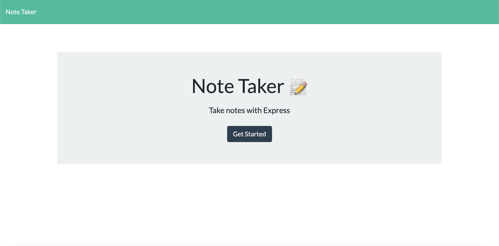
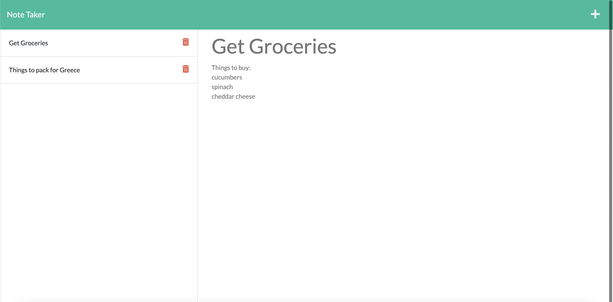

# UofT-SCS-Coding-Bootcamp-Homework-11-Note-Taker

## Table of Contents
* [Description](#desc)  
* [Installation](#install)  
* [Usage](#usage)  
* [Credits](#credits)  
* [License](#license)  
* [Github](#github)  

## Description

The purpose of this project was to modify stater code to create an application called Note Taker that can be used to write and save notes. This application uses an Express.js back end and saves and retrieves note data from a JSON File. The minimum viable product for this application was its ability to create and save notes. As a bonus, we were tasked with adding the DELETE route to the application to handle the deletion of notes. The application meets that bonus requirement. The application is deployed to Heroku.

## Installation
Follow the link below to the deployed application on Heroku.
 
 
## Usage
The following image shows the application's appearance and functionality.

The application should appear as follows on load:

The application should appear as follows after clicking Get Started:

 
## Credits
Uoft SCS Coding Bootcamp Gitlab

 
## License
Copyright [2021] [Sevag Gaprielian]

Licensed under the Apache License, Version 2.0 (the "License"); you may not use this file except in compliance with the License.
You may obtain a copy of the License at http://www.apache.org/licenses/LICENSE-2.0.

Unless required by applicable law or agreed to in writing, software
distributed under the License is distributed on an "AS IS" BASIS,
WITHOUT WARRANTIES OR CONDITIONS OF ANY KIND, either express or implied.
See the License for the specific language governing permissions and
limitations under the License.

 
## GitHub
Github: sevaggap  
Walkthrough Video: